# Compilation and Cross Compilation

---

- [Compilation and Cross Compilation](#compilation-and-cross-compilation)
  - [1. Introduction](#1-introduction)
    - [1.1 Preprocessing](#11-preprocessing)
    - [1.2 Compilation](#12-compilation)
    - [1.3 Assemble](#13-assemble)
    - [1.4 Linking](#14-linking)
    - [1.5 Object Files](#15-object-files)
    - [1.6 Example](#16-example)
  - [2. Static and Dynamic Linking](#2-static-and-dynamic-linking)
    - [2.1 Symbol Binding](#21-symbol-binding)
    - [2.2 Example](#22-example)
  - [3. Static Libraries](#3-static-libraries)

## 1. Introduction

 convert source code into low level machine code **for specific arch**
 multi stage process

>Typical GCC flow of operation


### 1.1 Preprocessing
>
> - Contain source with expanded : `#include` , `#define`
> - input : `*.c` , output : `*.i`

### 1.2 Compilation
>
> - "Expanded source code" compiled into **assembly**
> - input : `*.i` , output : `*.s`
> - `*.s` contains arch-specific assembly code

### 1.3 Assemble
>
>- Assembly compiled into object file
>- input : `*.s` , output : `*.o`
>- `*.o` contaims arch-specific machine code
>- Symbols

### 1.4 Linking
>
>- Most program composed of many object file
>- Links many object code into **single** object file
>- Compiled object contain reference for **Symbols**
>   - Symbols : refence to component
>     - function
>     - variable
>   - Symbols will be resolve to addr where components **located**
>- input : many `*.o` , output : single `*.o`
>- 2 types of Linking:
>   - Dynamic Linking
>   - Static Linking

### 1.5 Object Files

- 3 types
- Relocatble - non-executable, need to be link
- Executable - executable binary program
- Shared - shared library

ELF - Executable and Linkable Format

GCC execute all 4 stages
ex. cmd option

| options   | notes   |
|---|---|
| -o | set output name |
| -E | stop after preprocessing `*.i` |
| -S | stop after compilation `*.s` |
| -c | stop after assemble `*.o` |
| -save-temps | intermediate files saved |
| -I | specify non-std dir for header (*.h) files |
| -L | specify non-std dir for librarty (.a .so) files|
| -l[libname] | specify std lib to link i.e `-lc, -lm, -lpthread`|

---

### 1.6 Example

[compilation intro file](../examples/compilation%20intro/hello.c)

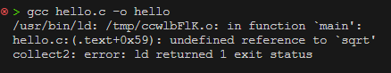

- math lib used but not linked
  
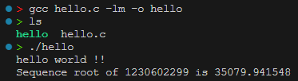

- link math lib
- std lib is automatically linked
- lib link must be after source file

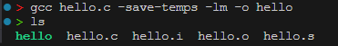

- all intermediate file is saved

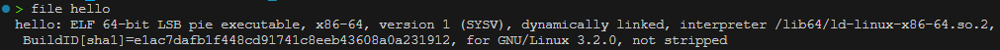

- check file attr
- above ex.
  - `ELF` - file type
  - `64-bit` - for 64bit machine
  - `LSB` - little endian
  - `pie` - position independant executable
  - `x86-64` - arch
  - `dynamically linked` - rely on shared object to succesfully run it
  - `/lib64/ld-linux-x86-64.so.2` - required interpreter
  - `not stripped` - got symbol to help debug

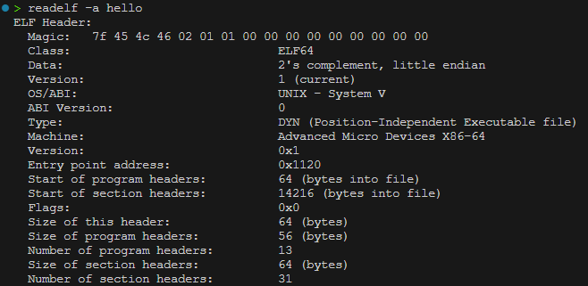

- to analyse binary

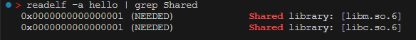

- show required Shared library

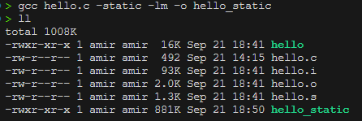

- `-static` to compiled as static linked
- file significantly bigger

## 2. Static and Dynamic Linking

- Symbol - a reference to component in object
  - link to object file
  - symbol link to object file can be resolve
    - at compile time
    - at runtime
- Dynamic linking
  - symbol might reference a component in external library
  - compiler create reference to symbol in final obj file
  - dynamic linker responsible to resolve all symbols
  - library must exist on target sys
  - shared libraries (.so)
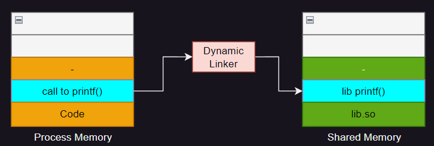

- Static linking
  - symbol resolve at compiled time, compiled into final obj file
  - all external lib, compiled into final obj
  - Executable contains **ALL** codes and data needed
  - not depend on any library to execute
  - large file

<style>
    .memory {
        width: 50%;
        text-align: center;
    }
    .memory th {
        background: grey;
        word-wrap: break-word;
        text-align: center;
    }
    .memory tr:nth-child(2) { background: orange; }
    .memory tr:nth-child(3) { background: aqua; }
    .memory tr:nth-child(4) { background: orange; }
</style>

<div class="memory">

|   |
|--|
| . |
| . |
| lib printf() |
| Code |

</div>
Process Memory

>*Process - executable program loaded into memory

### 2.1 Symbol Binding

- Binding -  resolving address of external symbol
- 2 type:
  - immediate binding
    - symbol resolved when process loaded into memory
    - longer load time
    - guaranteed resolved before execute
  - lazy binding
    - resolve on first use
    - use Procedure Lingkage Table (PLT)
    - Fast load time
    - not guaranteed resolved

### 2.2 Example

- `-d` only dump code
- `-D` dump everyhing
  


[hello dump file :](../examples/compilation%20intro/hello.dump)

```s
0000000000001209 <main>:
    1209:	f3 0f 1e fa          	endbr64 
    120d:	55                   	push   %rbp
    120e:	48 89 e5             	mov    %rsp,%rbp
    1211:	48 83 ec 20          	sub    $0x20,%rsp
    1215:	64 48 8b 04 25 28 00 	mov    %fs:0x28,%rax
    121c:	00 00 
    121e:	48 89 45 f8          	mov    %rax,-0x8(%rbp)
    1222:	31 c0                	xor    %eax,%eax
    1224:	48 8d 05 d9 0d 00 00 	lea    0xdd9(%rip),%rax        # 2004 <_IO_stdin_used+0x4>
    122b:	48 89 c7             	mov    %rax,%rdi
    122e:	e8 7d fe ff ff       	call   10b0 <puts@plt>
    1233:	48 8d 45 e8          	lea    -0x18(%rbp),%rax
    1237:	48 89 c7             	mov    %rax,%rdi
    123a:	e8 b1 fe ff ff       	call   10f0 <time@plt>
    123f:	89 c7                	mov    %eax,%edi
    1241:	e8 9a fe ff ff       	call   10e0 <srand@plt>
    1246:	e8 c5 fe ff ff       	call   1110 <rand@plt>
    124b:	89 45 e4             	mov    %eax,-0x1c(%rbp)
    124e:	66 0f ef c9          	pxor   %xmm1,%xmm1
    1252:	f2 0f 2a 4d e4       	cvtsi2sdl -0x1c(%rbp),%xmm1
    1257:	66 48 0f 7e c8       	movq   %xmm1,%rax
    125c:	66 48 0f 6e c0       	movq   %rax,%xmm0
    1261:	e8 9a fe ff ff       	call   1100 <sqrt@plt>
    1266:	66 48 0f 7e c0       	movq   %xmm0,%rax
    126b:	48 89 45 f0          	mov    %rax,-0x10(%rbp)
    126f:	48 8b 55 f0          	mov    -0x10(%rbp),%rdx
    1273:	8b 45 e4             	mov    -0x1c(%rbp),%eax
    1276:	66 48 0f 6e c2       	movq   %rdx,%xmm0
    127b:	89 c6                	mov    %eax,%esi
    127d:	48 8d 05 8f 0d 00 00 	lea    0xd8f(%rip),%rax        # 2013 <_IO_stdin_used+0x13>
    1284:	48 89 c7             	mov    %rax,%rdi
    1287:	b8 01 00 00 00       	mov    $0x1,%eax
    128c:	e8 3f fe ff ff       	call   10d0 <printf@plt>
```

- address to main file
- 'call' to get to specific function/component
- at the end (@plt) indicate it is dynamic link
  - dynamic linker helps to resolve it using shared library

---

[hello static dump file :](../examples/compilation%20intro/hello.dump)

```s
0000000000401775 <main>:
  401775:	f3 0f 1e fa          	endbr64 
  401779:	55                   	push   %rbp
  40177a:	48 89 e5             	mov    %rsp,%rbp
  40177d:	48 83 ec 20          	sub    $0x20,%rsp
  401781:	64 48 8b 04 25 28 00 	mov    %fs:0x28,%rax
  401788:	00 00 
  40178a:	48 89 45 f8          	mov    %rax,-0x8(%rbp)
  40178e:	31 c0                	xor    %eax,%eax
  401790:	48 8d 05 6d 68 09 00 	lea    0x9686d(%rip),%rax        # 498004 <_IO_stdin_used+0x4>
  401797:	48 89 c7             	mov    %rax,%rdi
  40179a:	e8 d1 11 01 00       	call   412970 <_IO_puts>
  40179f:	48 8d 45 e8          	lea    -0x18(%rbp),%rax
  4017a3:	48 89 c7             	mov    %rax,%rdi
  4017a6:	e8 85 d7 04 00       	call   44ef30 <time>
  4017ab:	89 c7                	mov    %eax,%edi
  4017ad:	e8 ce 96 00 00       	call   40ae80 <__srandom>
  4017b2:	e8 89 9d 00 00       	call   40b540 <rand>
  4017b7:	89 45 e4             	mov    %eax,-0x1c(%rbp)
  4017ba:	66 0f ef c9          	pxor   %xmm1,%xmm1
  4017be:	f2 0f 2a 4d e4       	cvtsi2sdl -0x1c(%rbp),%xmm1
  4017c3:	66 48 0f 7e c8       	movq   %xmm1,%rax
  4017c8:	66 48 0f 6e c0       	movq   %rax,%xmm0
  4017cd:	e8 4e 00 00 00       	call   401820 <__sqrt>
  4017d2:	66 48 0f 7e c0       	movq   %xmm0,%rax
  4017d7:	48 89 45 f0          	mov    %rax,-0x10(%rbp)
  4017db:	48 8b 55 f0          	mov    -0x10(%rbp),%rdx
  4017df:	8b 45 e4             	mov    -0x1c(%rbp),%eax
  4017e2:	66 48 0f 6e c2       	movq   %rdx,%xmm0
  4017e7:	89 c6                	mov    %eax,%esi
  4017e9:	48 8d 05 23 68 09 00 	lea    0x96823(%rip),%rax        # 498013 <_IO_stdin_used+0x13>
  4017f0:	48 89 c7             	mov    %rax,%rdi
  4017f3:	b8 01 00 00 00       	mov    $0x1,%eax
  4017f8:	e8 a3 a5 00 00       	call   40bda0 <_IO_printf>
```

- `call` go to symbols which
  - compiled staticly inside the executable
  - no require dynamic linker to resolve symbol 
  - ex. `printf` code is at address 0x40bda0

## 3. Static Libraries

>### Libraries
>
>collection of object for other program
>2 types:
>
>1. static
>2. shared
>
>static libraries: `*.a`
>compiled directly into final obj
>changes in library, require recompilation of linked binary
>not reside on target platform

#### Create library

- command: **`ar`**
- option: `cr` - create/recreate
- naming convention: start with lib
- need header file to define prototype
ex. `> ar cr libtest.a source1.o source2.o`
- to link:
  - `l<libNAME>` 'lib' is dropped
    - ex. `ltest`

#### Example

[static libraries](../examples/static%20libraries/doMath.c)

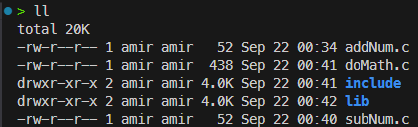

- lib - where static library `.a` will reside
- include - contain header file
- `addMath.c` and `subMath.c` are the source code to be compiled as lib

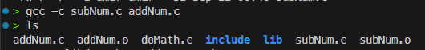

- create object file for each file

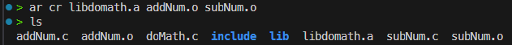
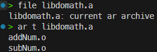

- create non-standard static library `libdomath.a`
- move to lib folder dir
- shows content of libdomath

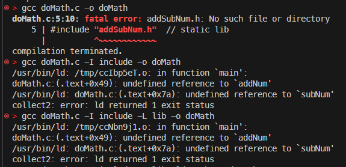

1. error because no lib linked
2. only lib header dir is included
3. not linking the library using `-l`
4. correct linking require :
   4.1. `-I` - header directory
   4.2. `-L` - lib directory
   4.3. `-l` - library link

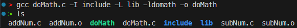
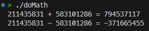

- success linking and execute